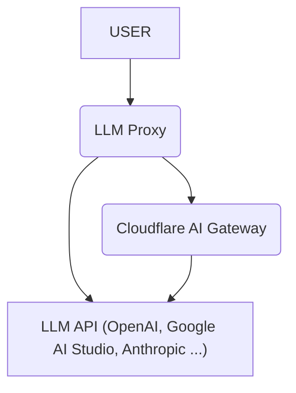

# LLM Proxy on Cloudflare Workers

English | [日本語](README_ja.md)

[](https://deploy.workers.cloudflare.com/?url=https://github.com/blue-pen5805/llm-proxy-on-cloudflare-workers)

This is a serverless proxy built on [Cloudflare Workers](https://www.cloudflare.com/developer-platform/products/workers/) that integrates with multiple Large Language Model (LLM) APIs. Inspired by [LiteLLM](https://github.com/BerriAI/litellm).

## Features

- **Centralized API Key Management:** Manage all your LLM API keys in one place.
- **Pass-through Endpoints:** Forward requests directly to any LLM API with minimal changes.
  - Examples: `/openai/chat/completions`, `/google-ai-studio/v1beta/models/gemini-2.5-pro:generateContent`
- **OpenAI-Compatible Endpoints:** Use standard OpenAI endpoints for seamless integration with existing tools and libraries.
  - `/v1/chat/completions`
  - `/v1/models`
- **Cloudflare AI Gateway Integration:** Leverage [Cloudflare AI Gateway](https://www.cloudflare.com/developer-platform/products/ai-gateway/), including its [Universal Endpoint](https://developers.cloudflare.com/ai-gateway/providers/universal/), for logging, analytics, and other features.
- **Global Round-Robin Key Rotation:** Consistency across all isolates using Cloudflare Durable Objects.
- **API Key Selection via Path Parameter:** Explicitly select or rotate within a range of API keys using `/key/{index|range}/` in the URL path.



## Supported Providers

| Name             | Chat Completions | Direct | AI Gateway Support | Pass-Through Routes | Environment Variable                         |
| ---------------- | ---------------- | ------ | ------------------ | ------------------- | -------------------------------------------- |
| OpenAI           | ✅               | ✅     | ✅                 | `openai`            | `OPENAI_API_KEY`                             |
| Google AI Studio | ✅               | ✅     | ✅                 | `google-ai-studio`  | `GEMINI_API_KEY`                             |
| Anthropic        | ✅               | ✅     | ✅                 | `anthropic`         | `ANTHROPIC_API_KEY`                          |
| Cerebras         | ✅               | ❌     | ✅                 | `cerebras`          | `CEREBRAS_API_KEY`                           |
| Cohere           | ✅               | ✅     | ✅                 | `cohere`            | `COHERE_API_KEY`                             |
| DeepSeek         | ✅               | ✅     | ✅                 | `deepseek`          | `DEEPSEEK_API_KEY`                           |
| Grok             | ✅               | ✅     | ✅                 | `grok`              | `GROK_API_KEY`                               |
| Groq             | ✅               | ✅     | ✅                 | `groq`              | `GROQ_API_KEY`                               |
| Mistral          | ✅               | ✅     | ✅                 | `mistral`           | `MISTRAL_API_KEY`                            |
| Perplexity       | ✅               | ✅     | ✅                 | `perplexity`        | `PERPLEXITY_API_KEY`                         |
| Azure OpenAI     | ❌               | ❌     | ❌                 | `azure-openai`      |                                              |
| Vertex AI        | ❌               | ❌     | ❌                 | `google-vertex-ai`  |                                              |
| Amazon Bedrock   | ❌               | ❌     | ❌                 | `aws-bedrock`       |                                              |
| OpenRouter       | ✅               | ✅     | ✅                 | `openrouter`        | `OPENROUTER_API_KEY`                         |
| Workers AI       | ✅               | ✅     | ✅                 | `workers-ai`        | `CLOUDFLARE_ACCOUNT_ID` `CLOUDFLARE_API_KEY` |
| HuggingFace      | ❌               | ✅     | ✅                 | `huggingface`       | `HUGGINGFACE_API_KEY`                        |
| Replicate        | ❌               | ✅     | ✅                 | `replicate`         | `REPLICATE_API_KEY`                          |
| Ollama           | ✅               | ✅     | ❌                 | `ollama`            | `OLLAMA_API_KEY`                             |

**Note**: Providers marked with ⚠️ have limited support for certain features (e.g., Tool Use, multimodal capabilities).

## Prerequisites

Before you begin, ensure you have the following installed:

- **Node.js:** Version `22.12+` or later is required.
  - Download from: [nodejs.org](https://nodejs.org/)
  - Verify your version: Run `node -v` in your terminal.
- **Cloudflare Account:** A Free Plan is probably sufficient to deploy this project.
  - Sign up for free at: [cloudflare.com](https://www.cloudflare.com/)

## Quick Start

1. Clone this repository.
2. Install dependencies: `npm install`
3. Authenticate with Cloudflare: `npm run cf:login`
4. Create configuration file: `cp config.example.jsonc config.jsonc`
5. Edit `config.jsonc` with your API keys
6. Deploy the Cloudflare Worker: `npm run deploy`
7. Deploy secrets: `npm run secrets:deploy`

For more detailed instructions, please refer to the [Initial Setup Guide](docs/initial-setup.md).

## Environment Variables

### Required:

- `PROXY_API_KEY`: API key to authenticate requests to the LLM Proxy server. (Any string can be used)

### Cloudflare AI Gateway (Optional)

Set these if you are using the Cloudflare AI Gateway.

- `CLOUDFLARE_ACCOUNT_ID`: Your Cloudflare account ID.
- `AI_GATEWAY_NAME`: Name of your AI Gateway.
- `CF_AIG_TOKEN`: (Optional) Authentication token for your AI Gateway.

### Provider API Keys

Set the API key(s) for each provider you intend to use. API keys can be a single string, a comma-separated string, or a JSON-formatted string array.

### Custom OpenAI-Compatible Endpoints (Optional)

You can add your own OpenAI-compatible endpoints by configuring the `CUSTOM_OPENAI_ENDPOINTS` array in `config.jsonc`.

Example:

```jsonc
"CUSTOM_OPENAI_ENDPOINTS": [
  {
    "name": "my-custom-llm",
    "baseUrl": "https://llm.example.com",
    "apiKeys": ["your-api-key"],
    "models": ["model-1", "model-2"] // Optional, pre-defined models list for /v1/models
  }
]
```

Once configured, you can access the custom endpoint using its name as a pass-through route:

- Pass-through: `https://your-worker-url/my-custom-llm/chat/completions`
- OpenAI-Compatible: Use `my-custom-llm/<model-id>` as the model name in `/v1/chat/completions` (e.g., `my-custom-llm/model-1`).

### Global Round-Robin Key Rotation (Optional)

This feature ensures that API keys are rotated in a consistent round-robin order across all requests globally, using Cloudflare Durable Objects.

- `ENABLE_GLOBAL_ROUND_ROBIN`: Set to `true` to enable this feature. (Default: `false`)

> [!IMPORTANT]
> Enabling this feature requires a Cloudflare account that supports Durable Objects.

### Local Development

When running locally with `npm run dev`, Wrangler automatically simulates Durable Objects.

### API Key Selection via Path Parameter

You can explicitly select an API key or a range for rotation by adding `/key/{index|range}/` to the start of the URL path. This bypasses the default global round-robin logic.

- **Single Key:** `/key/0/v1/chat/completions` (Selects the 1st key)
- **Range:** `/key/1-3/v1/chat/completions` (Selects a random key from index 1 to 3)
- **Unspecified End:** `/key/2-/v1/chat/completions` (Selects a random key from index 2 to the end)
- **Unspecified Start:** `/key/-4/v1/chat/completions` (Selects a random key from index 0 to 4)

Note: Random selection within a range is stateless and uses a cryptographically secure random number generator (`crypto.randomInt`).

## Usage Example

Send requests to your deployed Cloudflare Worker URL with the appropriate route and API key.

### OpenAI-Compatible Endpoints

These endpoints are designed to be compatible with the OpenAI API.

#### cURL

```bash
curl https://your-worker-url/v1/models \
  -H "Authorization: Bearer $PROXY_API_KEY" \
  -H "Content-Type: application/json"
```

```bash
curl -X POST https://your-worker-url/v1/chat/completions \
  -H "Authorization: Bearer $PROXY_API_KEY" \
  -H "Content-Type: application/json" \
  -d '{
    "model": "openai/gpt-4o",
    "messages": [{"role": "user", "content": "Hello, world!"}]
  }'
```

#### Python (OpenAI SDK)

```Python
from openai import OpenAI

client = OpenAI(
    api_key="PROXY_API_KEY",
    base_url="https://your-worker-url"
)
models = client.models.list()
for model in models.data:
    print(model.id)
```

```python
from openai import OpenAI

client = OpenAI(
    api_key="PROXY_API_KEY",
    base_url="https://your-worker-url"
)
response = client.chat.completions.create(
    model: "google-ai-studio/gemini-2.5-pro",
    messages: [{ "role": "user", "content": "Hello, world!" }],
)

print(response.choices[0].message.content)
```

### Pass-through Endpoints

Forward requests directly to the LLM provider's API using these endpoints.

#### cURL

```bash
curl -X POST https://your-worker-url/openai/chat/completions \
  -H "Authorization: Bearer $PROXY_API_KEY" \
  -H "Content-Type: application/json" \
  -d '{
    "model": "gpt-4o",
    "messages": [{"role": "user", "content": "Hello, world!"}]
  }'
```

```bash
curl -X POST https://your-worker-url/google-ai-studio/v1beta/models/gemini-2.5-pro:generateContent \
  -H "Authorization: Bearer $PROXY_API_KEY" \
  -H "Content-Type: application/json" \
  -d '{
    "contents": [{"role": "user", "parts": [{"text": "Hello, world!"}]}]
  }'
```

## Documentation

For detailed architectural and design information, please refer to the [Design Documentation](docs/design/overview.md).

## Known Issues and Limitations

This project is under active development and has the following known issues and limitations:

- **Incomplete Provider Support:** Not all LLM providers are fully supported. Some providers may have limited feature support or may not be supported at all.
