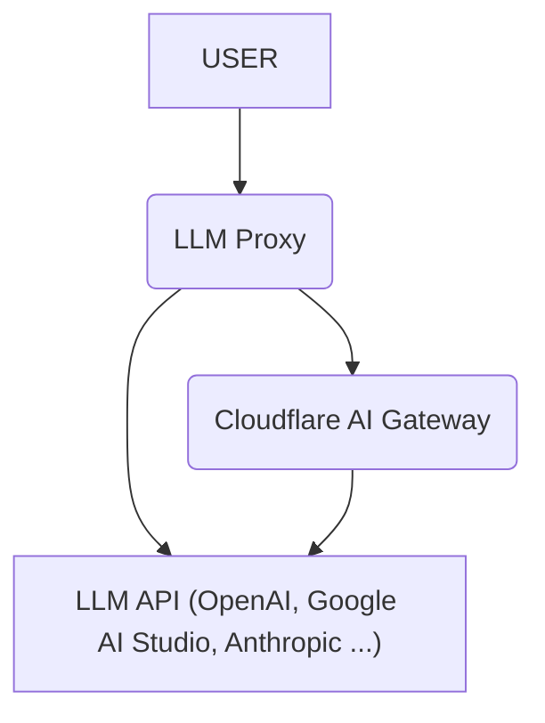

# Cloudflare Workers 上の LLM プロキシ

[English](README.md) | 日本語

[](https://deploy.workers.cloudflare.com/?url=https://github.com/blue-pen5805/llm-proxy-on-cloudflare-workers)

これは [Cloudflare Workers](https://www.cloudflare.com/developer-platform/products/workers/) 上に構築されたサーバーレスプロキシで、複数の大規模言語モデル（LLM）API と統合します。[LiteLLM](https://github.com/BerriAI/litellm) にインスパイアされています。

## 機能

- **一元化されたAPIキー管理:** すべてのLLM APIキーを一箇所で管理。
- **パススルーエンドポイント:** 最小限の変更でリクエストを任意のLLM APIに直接転送。
  - 例: `/openai/chat/completions`, `/google-ai-studio/v1beta/models/gemini-2.5-pro:generateContent`
- **OpenAI互換エンドポイント:** 既存のツールやライブラリとのシームレスな統合のための標準OpenAIエンドポイント。
  - `/v1/chat/completions`
  - `/v1/models`
- **Cloudflare AI Gateway統合:** ログ、分析、その他の機能のために [Cloudflare AI Gateway](https://www.cloudflare.com/developer-platform/products/ai-gateway/) の [Universal Endpoint](https://developers.cloudflare.com/ai-gateway/providers/universal/) を含む統合を活用。
- **グローバル・ラウンドロビン・キーローテーション:** Cloudflare Durable Objects を使用して、すべてのアイソレート間で一貫したローテーションを実現。
- **パスパラメータによるAPIキー指定:** URLパスに `/key/{index|range}/` を含めることで、使用するAPIキーのインデックスや範囲を明示的に指定・制限可能。



## サポートされているプロバイダー

| 名前             | チャット補完 | 直接 | AI Gateway サポート | パススルールート   | 環境変数                                     |
| ---------------- | ------------ | ---- | ------------------- | ------------------ | -------------------------------------------- |
| OpenAI           | ✅           | ✅   | ✅                  | `openai`           | `OPENAI_API_KEY`                             |
| Google AI Studio | ✅           | ✅   | ✅                  | `google-ai-studio` | `GEMINI_API_KEY`                             |
| Anthropic        | ✅           | ✅   | ✅                  | `anthropic`        | `ANTHROPIC_API_KEY`                          |
| Cerebras         | ✅           | ❌   | ✅                  | `cerebras`         | `CEREBRAS_API_KEY`                           |
| Cohere           | ✅           | ✅   | ✅                  | `cohere`           | `COHERE_API_KEY`                             |
| DeepSeek         | ✅           | ✅   | ✅                  | `deepseek`         | `DEEPSEEK_API_KEY`                           |
| Grok             | ✅           | ✅   | ✅                  | `grok`             | `GROK_API_KEY`                               |
| Groq             | ✅           | ✅   | ✅                  | `groq`             | `GROQ_API_KEY`                               |
| Mistral          | ✅           | ✅   | ✅                  | `mistral`          | `MISTRAL_API_KEY`                            |
| Perplexity       | ✅           | ✅   | ✅                  | `perplexity`       | `PERPLEXITY_API_KEY`                         |
| Azure OpenAI     | ❌           | ❌   | ❌                  | `azure-openai`     |                                              |
| Vertex AI        | ❌           | ❌   | ❌                  | `google-vertex-ai` |                                              |
| Amazon Bedrock   | ❌           | ❌   | ❌                  | `aws-bedrock`      |                                              |
| OpenRouter       | ✅           | ✅   | ✅                  | `openrouter`       | `OPENROUTER_API_KEY`                         |
| Workers AI       | ✅           | ✅   | ✅                  | `workers-ai`       | `CLOUDFLARE_ACCOUNT_ID` `CLOUDFLARE_API_KEY` |
| HuggingFace      | ❌           | ✅   | ✅                  | `huggingface`      | `HUGGINGFACE_API_KEY`                        |
| Replicate        | ❌           | ✅   | ✅                  | `replicate`        | `REPLICATE_API_KEY`                          |
| Ollama           | ✅           | ✅   | ❌                  | `ollama`           | `OLLAMA_API_KEY`                             |

**注意**: ⚠️でマークされたプロバイダーは、特定の機能（例：ツール使用、マルチモーダル機能）に対して限定的なサポートがあります。

## 前提条件

開始する前に、以下がインストールされていることを確認してください：

- **Node.js:** バージョン `22.12+` 以降が必要です。
  - ダウンロード: [nodejs.org](https://nodejs.org/)
  - バージョン確認: ターミナルで `node -v` を実行。
- **Cloudflare アカウント:** 無料プランでこのプロジェクトをデプロイするのに十分です。
  - 無料でサインアップ: [cloudflare.com](https://www.cloudflare.com/)

## クイックスタート

1. このリポジトリをクローンします。
2. 依存関係をインストール: `npm install`
3. Cloudflare で認証: `npm run cf:login`
4. 設定ファイルを作成: `cp config.example.jsonc config.jsonc`
5. APIキーで `config.jsonc` を編集
6. Cloudflare Worker をデプロイ: `npm run deploy`
7. シークレットをデプロイ: `npm run secrets:deploy`

より詳細な手順については、[初期セットアップガイド](docs/initial-setup_ja.md) を参照してください。

## 環境変数

### 必須:

- `PROXY_API_KEY`: LLMプロキシサーバーへのリクエストを認証するAPIキー。（任意の文字列を使用可能）

### Cloudflare AI Gateway（オプション）

Cloudflare AI Gateway を使用している場合は、これらを設定してください。

- `CLOUDFLARE_ACCOUNT_ID`: あなたのCloudflareアカウントID。
- `AI_GATEWAY_NAME`: AI Gatewayの名前。
- `CF_AIG_TOKEN`: （オプション）AI Gatewayの認証トークン。

### プロバイダーAPIキー

使用する予定の各プロバイダーのAPIキーを設定してください。APIキーは、単一の文字列、カンマ区切りの文字列、またはJSON形式の文字列配列にできます。

### カスタム OpenAI 互換エンドポイント（オプション）

`config.jsonc` の `CUSTOM_OPENAI_ENDPOINTS` 配列を設定することで、独自の OpenAI 互換エンドポイントを追加できます。

設定例:

```jsonc
"CUSTOM_OPENAI_ENDPOINTS": [
  {
    "name": "my-custom-llm",
    "baseUrl": "https://llm.example.com",
    "apiKeys": ["your-api-key"],
    "models": ["model-1", "model-2"] // オプション: /v1/models エンドポイント用の事前定義したモデルリスト
  }
]
```

設定後、その名前をパススルールートとして使用してカスタムエンドポイントにアクセスできます：

- パススルー: `https://your-worker-url/my-custom-llm/chat/completions`
- OpenAI互換: `/v1/chat/completions` でモデル名として `my-custom-llm/<model-id>` を指定します（例: `my-custom-llm/model-1`）。

### グローバル・ラウンドロビン・キーローテーション（オプション）

Cloudflare Durable Objects を使用して、すべてのリクエスト間で一貫したラウンドロビン順序で API キーをローテーションする機能です。

- `ENABLE_GLOBAL_ROUND_ROBIN`: `true` に設定すると有効になります。（デフォルト: `false`）

> [!IMPORTANT]
> この機能を有効にするには、Durable Objects をサポートする Cloudflare アカウントが必要です。

### ローカル開発

`npm run dev` でローカル実行する場合、Wrangler は自動的に Durable Objects をシミュレートします。

### パスパラメータによるAPIキー指定

URLパスの先頭に `/key/{index|range}/` を追加することで、使用するAPIキーを明示的に指定したり、特定の範囲内でのランダム選択に制限したりできます。この指定はデフォルトのグローバル・ラウンドロビン・ロジックを上書きします。

- **単一指定:** `/key/0/v1/chat/completions` (1番目のキーを使用)
- **範囲指定:** `/key/1-3/v1/chat/completions` (インデックス 1〜3 からランダムに選択)
- **終端未指定:** `/key/2-/v1/chat/completions` (インデックス 2から最後までの間でランダムに選択)
- **始点未指定:** `/key/-4/v1/chat/completions` (インデックス 0〜4 の間でランダムに選択)

※範囲内でのランダム選択はステートレスであり、暗号学的に安全な乱数生成器 (`crypto.randomInt`) を使用します。

## 使用例

適切なルートとAPIキーを使用して、デプロイされたCloudflare Worker URLにリクエストを送信します。

### OpenAI互換エンドポイント

これらのエンドポイントは、OpenAI APIと互換性があるように設計されています。

#### cURL

```bash
curl https://your-worker-url/v1/models \
  -H "Authorization: Bearer $PROXY_API_KEY" \
  -H "Content-Type: application/json"
```

```bash
curl -X POST https://your-worker-url/v1/chat/completions \
  -H "Authorization: Bearer $PROXY_API_KEY" \
  -H "Content-Type: application/json" \
  -d '{
    "model": "openai/gpt-4o",
    "messages": [{"role": "user", "content": "Hello, world!"}]
  }'
```

#### Python (OpenAI SDK)

```Python
from openai import OpenAI

client = OpenAI(
    api_key="PROXY_API_KEY",
    base_url="https://your-worker-url"
)
models = client.models.list()
for model in models.data:
    print(model.id)
```

```python
from openai import OpenAI

client = OpenAI(
    api_key="PROXY_API_KEY",
    base_url="https://your-worker-url"
)
response = client.chat.completions.create(
    model: "google-ai-studio/gemini-2.5-pro",
    messages: [{ "role": "user", "content": "Hello, world!" }],
)

print(response.choices[0].message.content)
```

### パススルーエンドポイント

これらのエンドポイントを使用して、リクエストをLLMプロバイダーのAPIに直接転送します。

#### cURL

```bash
curl -X POST https://your-worker-url/openai/chat/completions \
  -H "Authorization: Bearer $PROXY_API_KEY" \
  -H "Content-Type: application/json" \
  -d '{
    "model": "gpt-4o",
    "messages": [{"role": "user", "content": "Hello, world!"}]
  }'
```

```bash
curl -X POST https://your-worker-url/google-ai-studio/v1beta/models/gemini-2.5-pro:generateContent \
  -H "Authorization: Bearer $PROXY_API_KEY" \
  -H "Content-Type: application/json" \
  -d '{
    "contents": [{"role": "user", "parts": [{"text": "Hello, world!"}]}]
  }'
```

## ドキュメント

プロジェクトのアーキテクチャや技術的な設計の詳細については、[設計書 (English)](docs/design/overview.md) を参照してください。

## 既知の問題と制限事項

このプロジェクトは現在開発中で、以下の既知の問題と制限事項があります：

- **不完全なプロバイダーサポート:** すべてのLLMプロバイダーが完全にサポートされているわけではありません。一部のプロバイダーは機能サポートが限定的であったり、まったくサポートされていない場合があります。
